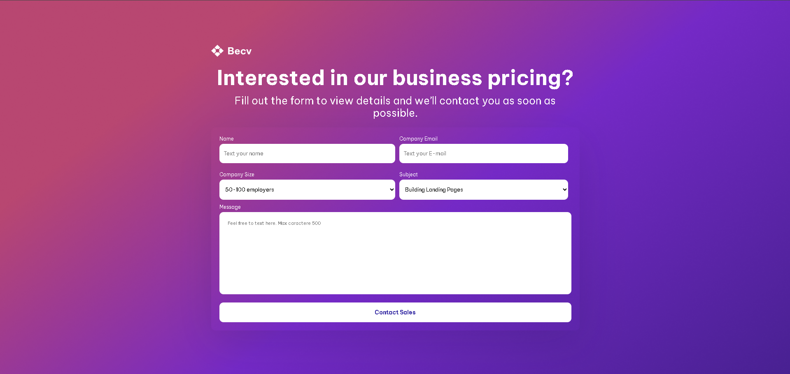
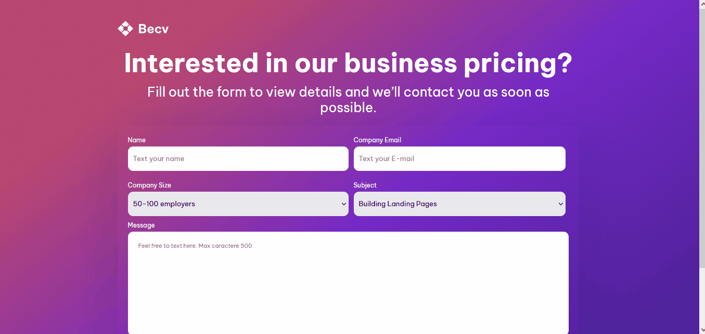
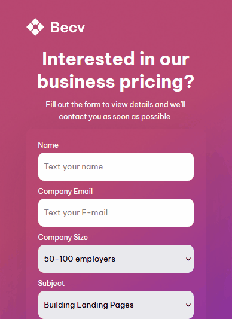

<h1 align="center">Contact Page</h1>

  Projeto da Dev Challenges para praticar conhecimentos em HTML e CSS.

  

 

## 🚀 Tecnologias

Esse projeto foi desenvolvido com as seguintes tecnologias:

- HTML e CSS
- Git Github

## 💻 Projeto

Contact Page é uma página de formulário, voltado para contratar pessoas para trabalhar.

## Como ficou o projeto online

  

  

## Mobile

  
<a href="https://dev-challenges-contact-page-lime.vercel.app/" target="_blank">Clique para</a> acessar o link</a>
  

## Conclusão

Projeto bom para praticar formulário e saber mais sobre a hierarquia do HTML na hora de saber construir um bom CSS.